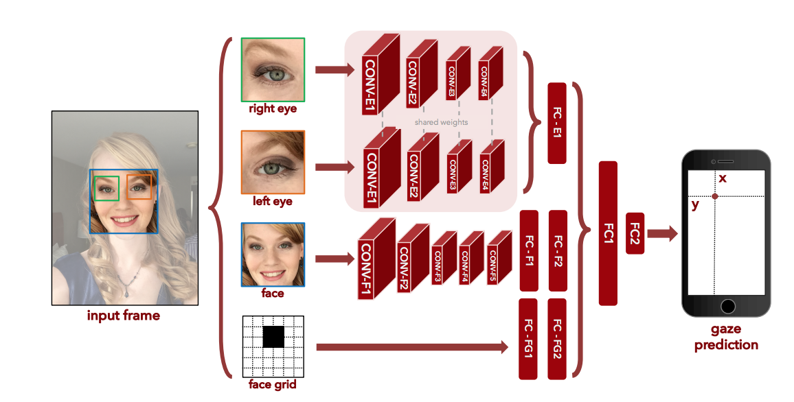

## EyeGazing
### Implementation of paper <a href="https://gazecapture.csail.mit.edu/cvpr2016_gazecapture.pdf">Eye Tracking for Everyone </a> for detection of line of sight of pupil using deep neural networks
 

### Working of the model :

### Result from the model :

### model architecture : 

